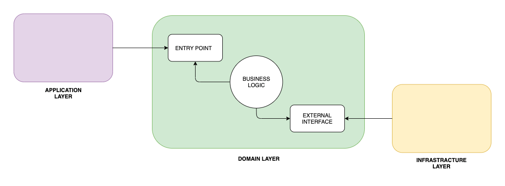
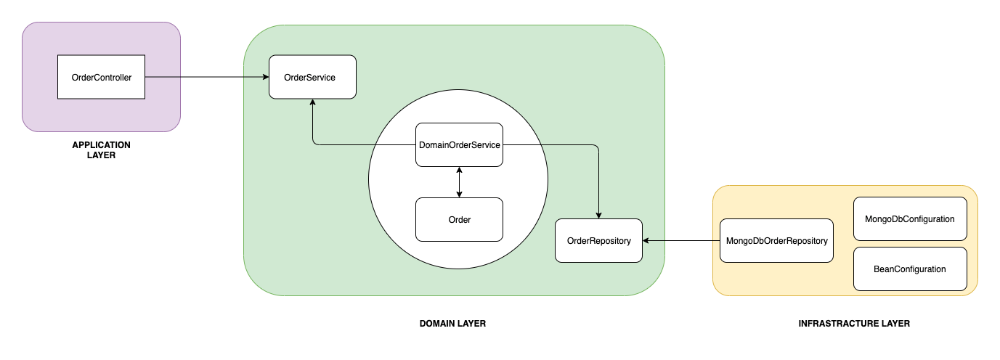

The architecture in this application is an implementation of this article:
https://www.baeldung.com/hexagonal-architecture-ddd-spring:

# Layers

### Domain

This module should contain the core business logic of the application. It should
be independent of any infrastructure or presentation concerns. This module should define the domain
objects, domain services, and domain events.

### Infrastructure

This module should contain the implementation of the interfaces defined
in
the domain module. This includes things like repositories, event publishers/subscribers, and other
infrastructure components that are specific to your application.

### Application

This module should contain the application logic, which coordinates the
interactions between the domain and infrastructure layers. It should be responsible for defining the
use cases and application services that interact with the domain objects and the infrastructure.

## Dependency Restrictions

- The **domain module** should not depend on any other module.
- The **infrastructure module** should depend on the domain module, to implement the interfaces defined
  in the domain layer.
- The **application module** should depend on both the domain and infrastructure modules, to coordinate
  the interactions between them.